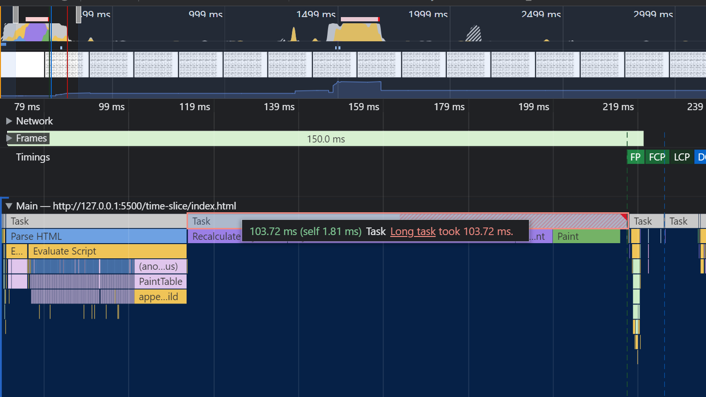
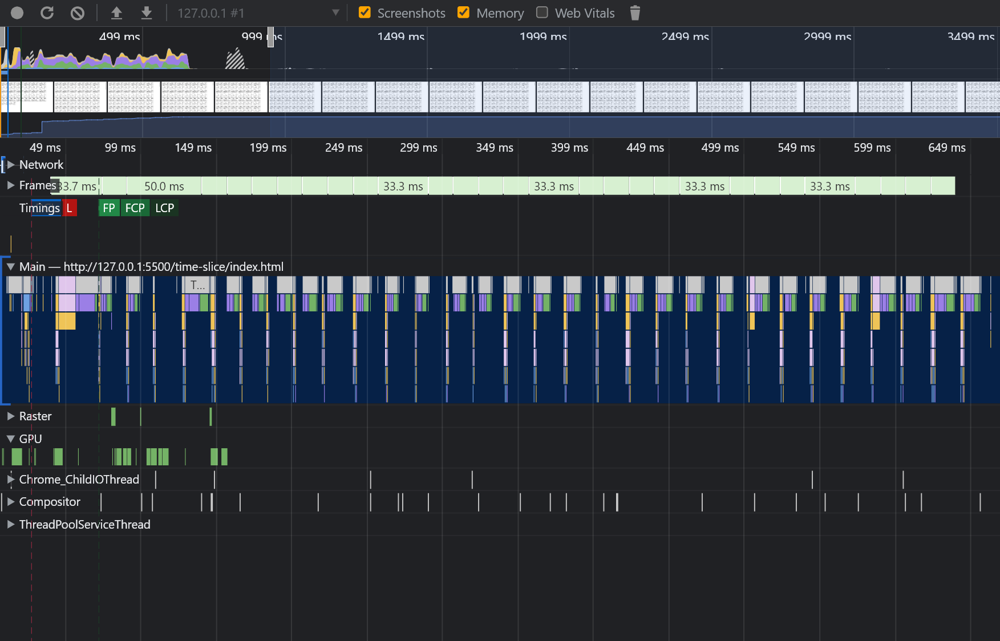
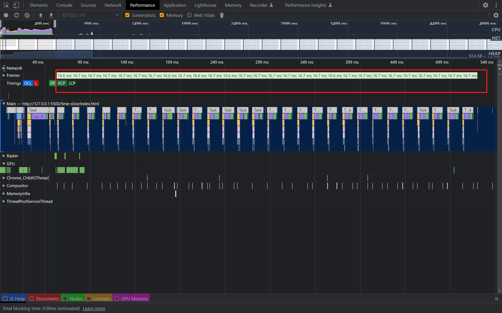

# 时间切片 （time slice）

**时间切片**并不是一个 web-api，它是一种用来提高渲染页面帧率的技术方案。

在说说**时间切片**这个技术之前，我认为先有必要聊聊为什么需要时间切片。

假设页面内某个渲染 DOM 的任务执行长达 1000ms，那么整个页面的交互会有肉眼可见的卡顿感。在这 1000ms 内浏览器需要不断地绘制 DOM 树，而用户恰好又想滚动页面，而滚动事件就会被阻塞调用。

我们知道在浏览器中，GUI 渲染线程和脚本线程是互斥的，也就是说当 GUI 渲染线程工作的时候，脚本线程的任务无法被调度执行。当脚本线程工作的时候，渲染线程无法进行 **style**、**layout** 以及 **dom** 的计算。

来看下面一个示例：

```html
<template>
   <table border="1">
      <thead>
         <tr>
            <th>Name</th>
            <th>Caloires</th>
         </tr>
      </thead>
      <tbody>
         <tr>
            <td>Frozen Yogurt</td>
            <td>159</td>
         </tr>
         <tr>
            <td>Ice cream sandwich</td>
            <td>237</td>
         </tr>
         <tr>
            <td>Cupcake</td>
            <td>262</td>
         </tr>
      </tbody>
   </table>
</template>
```

```js
const tpl = document.querySelector("template");

function renderTable() {
   const fragment = document.createDocumentFragment();
   for (let index = 0; index < 500; index++) {
      const dom = document
         .createRange()
         .createContextualFragment(tpl.innerHTML);
      fragment.appendChild(dom);
   }
   app.appendChild(fragment);
}
```

在 `renderTable()` 函数内会执行 500 次循环来创建 500 个表格，当循环结束后，将创建好的 500 个 dom 节点挂载到 app 元素下。如果在创建过程中我们执行了其他的操作这些操作一定会被阻塞直到 `renderTable()` 函数执行结束。

通过 chrome devtools 的 performance 面板我们可以看到渲染 500 个 table 耗时长 达 103 ms，这 103 ms 由 计算样式 + 计算布局 + 绘制 DOM 组成。并且 Chrome Devtools 将其标注为 **Long task**, Long task 意味着该任务对耗时较长且交互体验糟糕。



为了解决这类问题，我们可以将一个耗时长的任务切分成多个小的任务精确调度执行。

例如，创建 500 个 table 这个大的任务我们可以切分成 30 个小任务，每个小任务创建 16 个节点。要想实现任务切分，我们可以借助 `setInterval`、`setTimeout` 这类的 API 实现。

```js
function timeSlice(fn, count) {
   let timer;
   let calledNum = 0;

   return {
      run() {
         clearTimeout(timer);
         timer = setTimeout(() => {
            if (++calledNum <= count) {
               fn();
               this.run();
            }
         }, 16.6);
      },
   };
}
```

我们声明了一个 `timeSlice()` 函数返回的 `run()` 函数内会在调用期间每隔 `16.6` 毫秒回调执行 fn，当回调次数超过指定的 `count` 将终止回调。

那么现在就来看看添加时间切片后的优化到底有没用。

```js
timeSlice(() => {
   const fragment = document.createDocumentFragment();
   for (let index = 0; index < 16; index++) {
      const dom = document
         .createRange()
         .createContextualFragment(tpl.innerHTML);
      fragment.appendChild(dom);
   }
   app.appendChild(fragment);
}, 30).run();
```

我们打开 devtools 点击 performance 面板的 reload 按钮记录得到下面的一次快照：



根据上图可以看到由于我们对一个大的任务进行了切分，变成了若干个密密麻麻的小任务。现在渲染后已经不存在 long task 的标记了，页面的流畅性也提升了很多

由于对任务进行了细致的切分，当我们执行其他的交互操作时界面也不会有卡顿（脚本线程在执行完每个小任务后会腾出时间立即执行主线程上其他的任务）。

看起来我们已经完成了时间切片的操作，但是这里仍然有着缺陷。

我们知道 `setTimeout` 这类的定时器 API 并不会准确的根据用户传入的时间执行，如果有其他的任务一直在长时间的执行，那么 `setTimeout` 的回调会一直在任务队列里等待。而且 `setTimeout` 这类的 API 也会有丢帧的现象。因为 `setTimeout` 无法做到用户的回调会在每一帧最开始执行。

说到这，你可能已经想到了最终的解决方案 - **rAF**。

是的，我们可以借助浏览器提供的 `requestAnimationFrame` API 弥补上面提到的缺陷。 `requestAnimationFrame` 能够让用户精确的控制在每一帧绘制之前执行相关的回调，这也是唯一的一个拥有此能力的 API。

如果你还不熟悉这个 API， 那么我认为你很有必要去 MDN 搜索相关的资料。

借助 rAF，我们来重写 `timeSlice` 函数：

```js
function timeSlice(fn, count) {
   let timer;
   let calledNum = 0;
   return {
      run() {
         window.cancelAnimationFrame(timer);
         timer = window.requestAnimationFrame((timstamp) => {
            if (calledNum++ >= count) {
               window.cancelAnimationFrame(timer);
            } else {
               fn();
               this.run();
            }
         });
      },
   };
}
```

再一次通过 performance 记录本次渲染的快照，可以看到相比 `setTimeout` ，我们的界面上每一帧的绘制时间都是每隔 16ms 毫秒，这样不仅解决了上面的丢帧现象，而且能够确保回调函数会在每一次渲染之前被调用。



## 总结

在本文我们通过引入时间切片技术，将一个耗时较长的大任务拆分成若干个小任务。避免因某些长任务一直在主线程被执行导致无法让出主线程的控制权，导致界面卡死。通过这种方案我们可以让浏览器在每次执行小任务后去执行其他的任务，让页面的渲染以及用户交互变得更加流畅。